<style type="text/css">
.main-container {
  width: 90% !important;
  max-width: 1200px;
  margin-left: auto;
  margin-right: auto;
}
</style>
<style>
  hr {
    box-sizing: border-box;
    width: 100%;
    margin: 0;
  }
</style>
<hr style="border: 4px double #3E1628; background-color: #7B1F3F; height: 1px; width: 100%; margin: 0; border-radius: 10px;">
<h1 style="font-size: 50px;">Day 1</h1>

*Written by:* *{{ page.author }}*  
*Editors:* *{{ page.editors }}*

<hr style="height: 5px; background-color: #7B1F3F; border: none; width: 100%; border-radius: 10px;">

## *i.* Course goal
<hr style="height: 5px; background-color: #7B1F3F; border: none; width: 100%; border-radius: 10px;">

Hello and welcome to our bulk RNA-seq analysis course! This course aims to equip you with the foundational skills and knowledge required to set up a supercomputing environment and analyse a bulk RNA-seq dataset from FASTQ prefetch to identifying genes of interest. We will use a simple public data set to demonstrate how to do this. At the end of this course, we will offer our support in setting up your own custom analysis pipeline. We strongly encourage you to attend each session as it may be difficult to catch up later.
<br>
<hr style="height: 5px; background-color: #7B1F3F; border: none; width: 100%; border-radius: 10px;">

## *ii.* Today's Learning objectives
<hr style="height: 5px; background-color: #7B1F3F; border: none; width: 100%; border-radius: 10px;">

You should expect to:
- Set up a remote session using your laptop.
- Navigate and use the Hawk supercomputing environment.
- Call basic Unix commands with working examples.
- Download raw bulk RNA-seq data from a public repository.
- Reproduce today's analysis with own data.
<br>
<hr style="height: 5px; background-color: #7B1F3F; border: none; width: 100%; border-radius: 10px;">

## *iii.* What we will not do here
<hr style="height: 5px; background-color: #7B1F3F; border: none; width: 100%; border-radius: 10px;">

- Cover how RNA-seq libraries are generated and next generation sequencing (NGS). Watch this [video](https://www.youtube.com/watch?v=tlf6wYJrwKY) for an overview.
- Cover more advanced sequencing technologies (e.g. scRNA-seq). We also provide training in scRNA-seq analysis.
- Overburden you with too much information; we will signpost towards further reading and support where appropriate.
<br>
<hr style="height: 5px; background-color: #7B1F3F; border: none; width: 100%; border-radius: 10px;">

## BASH scripting

---
* <font color="red">BASH scripts are ultimately not an efficient method of storing a workflow.</font> 
<br>

---
# 2. An introduction to nf-core
--- 
- A community-led framework which hosts a curated set of open-source analysis [pipelines](https://nf-co.re/pipelines/) built using Nextflow.
- Includes >100 maintained pipelines and >1400 reusable modules that aim  to be accessible, well-documented, and easily understandable.
  - Adheres to [FAIR](https://fellowship.elixiruknode.org/latest/carpentries-course-fair-pointers) principles. 
- Its ethos encompasses open-sourced, collaborative and supportive principles. Their seminars and training are free to join and they offer further support through their [slack](https://nf-co.re/join) channel.
- **We will be using up-to-date nf-core pipelines for our analysis**. 
<br>

---
## 2.1. What is nextflow?
---
- Both a workflow management system and a domain-speciifc language based on Java and Groovy, meaning it:
  - Allows us to execute increasingly more complex tasks in the age of big data.
  - Runs several different tasks on Hawk automatically with minimal input. Convenient!
  - Organises our tasks through channels, allowing them to communicate with each other.
<br>
*Channels commonly convey data inpts and outputs between processes to get to the final product:*

<br>
<details>
<summary><b>Nextflow boasts many other benefits...</b></summary>

<br>

Each task can be written in virtually any coding language.

<br>

Is portable (compatible across platforms and job schedulers on the supercomputer).

<br>

Is reproducible through containerisation and version control.

<br>

Is highly customisable.

<br>

Easily resume work from any checkpoint.

<br> 

Parallel processing - performs many tasks independently and simultaneously.

<br>

</details>
<br>

---
### 2.1.1. What you should know
---
Everytime you execute or resume Nextflow a unique work directory based on a hash is created. This work directory is used to stage input files and scripts in addition to writing outputs for downstream tasks and/or publishing (desired outputs are copied over to our project input and output directories).

You will find the Nextflow logfile and work directory from wherever you execute your nf-core pipeline. For example:

```bash
$ tree -a work
work
└── 39
    └── ef16fd4a3de2f512ed91a85ce900bf
        ├── .command.sh
        ├── .command.out
        ├── .command.err
        ├── .command.log
        ├── R1.fastq
        └── R2.fastq
```
reveals a very simplified expected Nextflow work directory structure containing final and/or intermediate data outputs and error files.
<br>
<details>
<summary><b>How to navigate these hidden files</b></summary>

File name|Description|Useful how?
|:------:|:--------:|:----------:|
.command.sh|Script Nextflow uses to run a task|Easier to spot syntax/variable issues
.command.out|Process standard output|Prints results that would normally go to the terminal & check if process completed successfully
.command.err|Process standard error|For reading warnings, errors, and debugging
.command.log|Combined standard output & error|Get a full picture of what went wrong
</details>

<br>
The nextflow logfile (.nextflow.log) is handy to view the total pipeline execution history and can shed light on potential errors, resource usage, time to completion and task submission details.

<br>
<br>
<div style="background-color:#250D18; border-top: 37px solid #7B1F3F; padding: 10px 16px 10px; color: #DEABA0; position: relative;">
    <span style="position: absolute; top: -30px; left: 1px; font-weight: bold; color: #DEABA0; background-color: #7B1F3F; padding: 5px 10px; line-height: 20px; display: inline-block; border-radius: 4px;">
        &#128221; Note:
    </span>
    Learning Nextflow from scratch can be daunting. We will not go into unnecessary detail here, though there are several good resources and training opportunities we recommend through 
    <a href="https://arcca.github.io/index.html#register-for-future-courses" style="color: #019E95; text-decoration: underline;">ARCCA</a>, <a href="https://nf-co.re/events/training" style="color:  #019E95; text-decoration: underline;">nf-core</a>, and 
    <a href="https://www.nextflow.io/docs/latest/index.html" style="color: #019E95; text-decoration: underline;">Nextflow</a> documents.
</div>
<br>

---
## 2.2. nf-core/fetchngs Pipeline
---
- This pipeline allows us to fetch metadata and raw FastQ files from public and private databases
- The pipeline currently supports SRA/ENA/DDBJ/GEO/Synapse IDs.
- The only input it needs is a list of accessions (sequence database IDs).
---

<br>

---
## Finding a dataset
---
---

- We first need to find a dataset. Some of you may already have found one via a paper that you have read etc.
- There are multiple repositories that we can find samples on. The two most common are **Gene Expression Omnibus ([GEO](https://www.ncbi.nlm.nih.gov/geo/))** and **[Array Express](https://www.ebi.ac.uk/biostudies/arrayexpress)**.
- For this course, we will use **GEO** to find our dataset.

---

<br>

---
#### GEO

- When accessing the GEO website, we are faced with multiple links and tools.
- If we have a dataset in mind that we would like to find, we can use the search bar at the top right of the page.

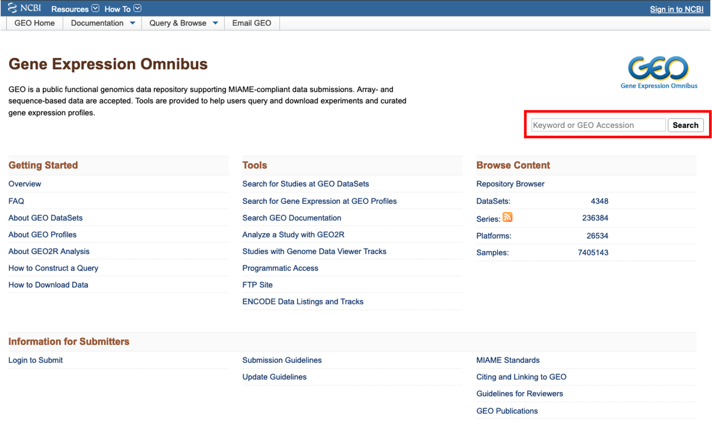

- I would like to find a bulk rna seq dataset on renal cell carcinoma. To do this, I enter '**renal cell carcinoma rna seq**' into the search bar and click 'search'.
- A pop-up window appears telling me that there are 351 results. Clicking on the '351' will load the results.

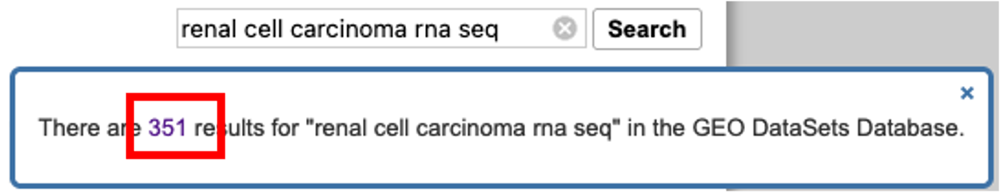

- On the results page, we are greeted with the results accompanied by further optional filters on the left and right hand side of the page.

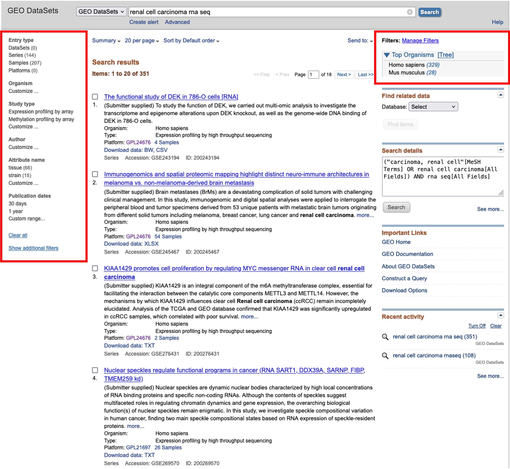

- Here, we will choose to filter for **Homo sapiens** using the option on the right hand side and then browse for an interesting dataset.
- For this course, I found a nice dataset looking at the effects of hypoxia on gene expression across two different cell lines.

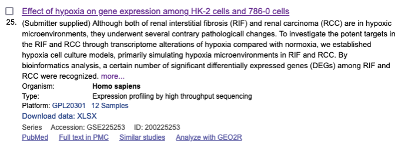

- Clicking on the dataset title will load the series record for that dataset. Can everyone follow this [link](https://www.ncbi.nlm.nih.gov/geo/query/acc.cgi?acc=GSE225253) and follow along.

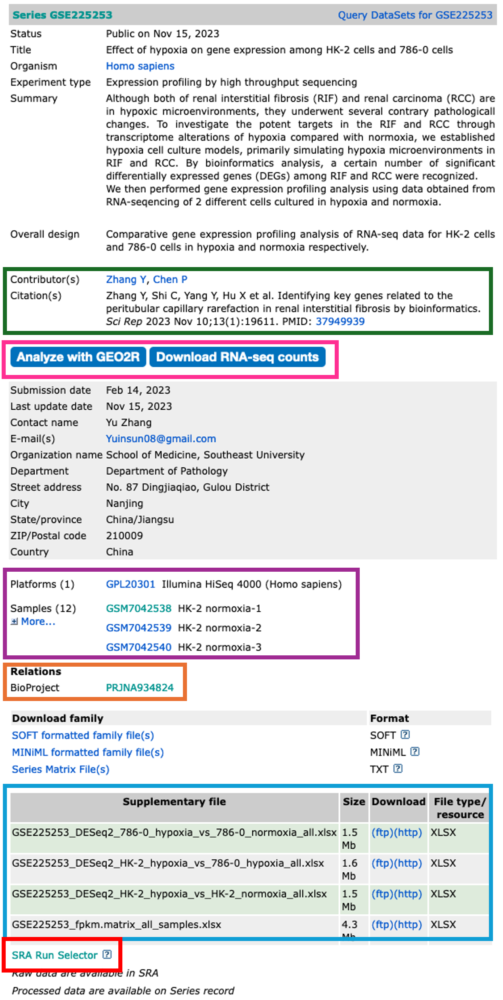

- The dataset series record page displays the all the relevant information about that dataset.
- Towards the top of the page, you will find information about the study in which the dataset was used.

<span style="color:green;">**Contributors and Citation**</span>
- The authors and any related publication can be found in the contributors and citations sections.

<span style="color:deeppink;">**Analyze with GEO2R and Download RNA-seq counts**</span>
- The **Analyze with GEO2R** option has been on GEO for quite some time, and is a handy tool to use if you are performing the most basic of analyses.
- The tool allows you to define your own groups and can perform Differential Gene Expression (DGE) analyses rather quickly.
- It's a great tool, but doesn't always work on the dataset you want to analyse (depends on what data the authors have uploaded)
- **It's worth checking this tool out before continuing**. We won't be covering this tool during this course. If you would like a run through on it, please get in touch.

<details>
<summary><b>Analyze with GEO2R tool</b></summary>

<br>

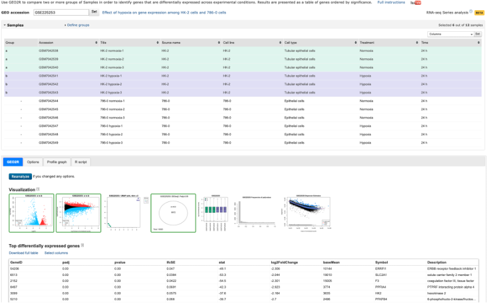

</details>

<br>

- The **Download RNA-seq counts** option takes you to a page which provides you with download links to all of the uploaded and NCBI-generated data.
- This is really handy as it highlights what each piece of data is.
- Again, this may not contain the raw sequencing data, but worth checking before proceeding.

<details>
<summary><b>Download RNA-seq counts</b></summary>

<br>

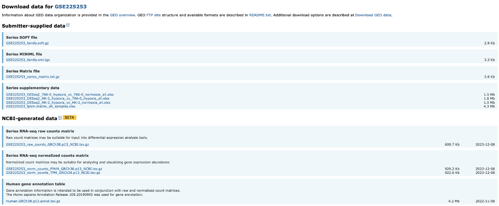

</details>

<span style="color:purple;">**Platforms and Samples**</span>
- This section shows us information about the samples and what platform they were sequenced on.

<span style="color:orange;">**BioProject**</span>
- The raw sequencing data for a dataset is stored in the **Sequencing Read Archive (SRA)**. Once samples have been uploaded, they are given a BioProject ID.
- This BioProject ID link takes us straight to where the raw sequencing data is stored.

<span style="color:blue;">**Supplementary files**</span>
- All the associated data is stored in this section.
- What you have here is completely down to how nice the authors are.
- For a GEO upload, the authors must upload normalised data tables in which their observations were made.
- Sometimes authors also upload Differentially Expressed Gene (DEG) tables and raw sequencing read counts.
- These authors have been so very kind to upload their DEGs, so there really is no need for us to continue on. But most authors do not upload these, so we will need to make them ourselves.

<span style="color:red;">**SRA Run Selector**</span>
- The SRA Run Selector link takes us directly to the SRA where we can download the sequencing data.
- Some may be asking, isn't this the same as the BioProject ID link? Yes and no.
- The BioProject ID link takes you to an overview page, just like the GEO page we are currently on.
- The SRA Run Selector link takes us directly to the page where we can download the data.

---

<br>

---
#### Downloading the relevant data
---
---

- We will be downloading **6 normoxia** samples, 3 from each cell line.
- To do this, we need to click on the **SRA Run Selector** link.
  1) Once the new page has loaded, we can go ahead and use the filter tool on the top left to select **8: Treatment**, then **normoxia**.
  2) This filters the table at the bottom of the screen. We can then click the tick box at the top left of the table to **select all 6 samples**.
  3) Once all samples are selected, we can now click on the **sliding Selected tab** so move it to the right. This filters the data to include only the samples we have selected.
  4) Now we can click on the **Accession list** option. This downloads a text file called **SRR_Acc_List.txt**.

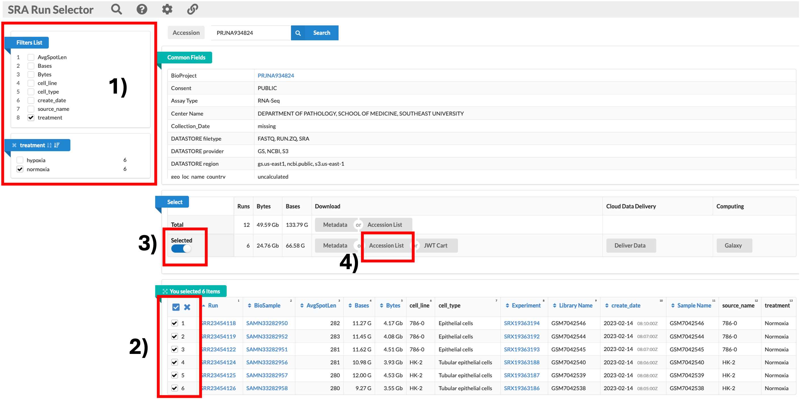

<details>
<summary><b>SRR_Acc_List.txt</b></summary>

<pre><span style="color:crimson;">
SRR23454118
SRR23454119
SRR23454122
SRR23454124
SRR23454125
SRR23454126
</span></pre>

</details>

---

<br>

---
# nf-core/fetchngs pipeline
---
---

- To keep things as simple as possible for users, I have created a GitHub repository which contains all of the directory structures and relevant scripts to perform each task for us.
- This will hopefully make things easier for users who are not so confident with coding.

<br>

---
### Log into HAWK
---
---

- Lets first log onto HAWK. We will be doing all of our coding within VSCode.
- <b>If you do not have VSCode set-up, please let me know now so that we can get you up and running.</b>
- Note: those of you using Linux may have to use code to do this. I will include the code below each section.

---
- Firstly, make sure you are connected to the VPN. If you are on-campus, theres no need.
- In VSCode, click on the 'Remote Explorer' button, then click 'Connect to Host in New Window' button. This opens a new VSCode window with the remote host.
- You will be prompted (top box) to enter your password. Do this and hit enter.
- You are now connected to HAWK.

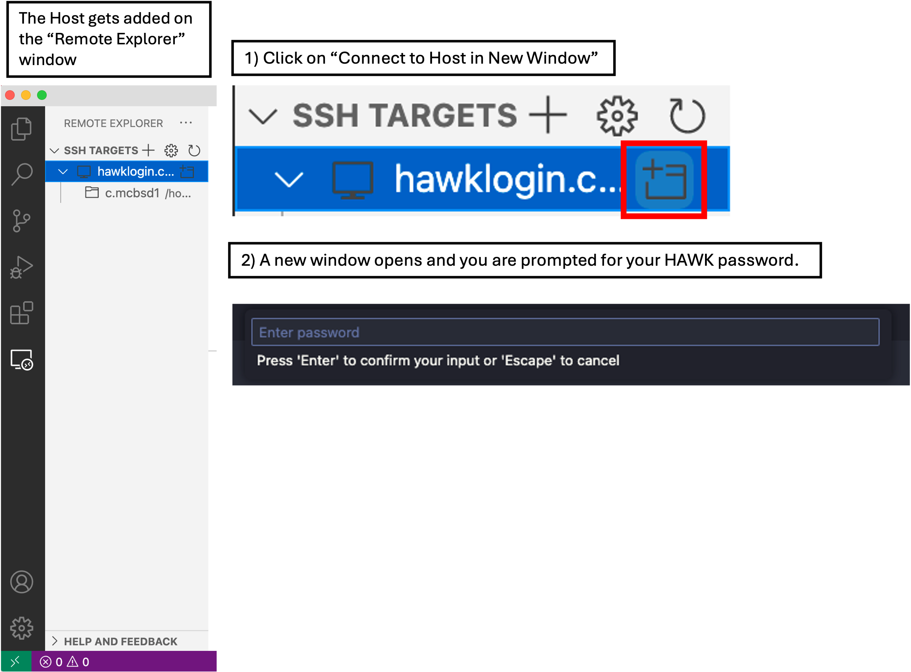


***Linux Users***
- In your shell, log into HAWK with:
```
ssh c.c1234567@hawklogin.cf.ac.uk
#Enter Password
```

<br>

---
### Fetch the project from GitHub
---
---

- To get the project directory from GitHub, we simply copy and paste one line of code below.
- We will first want to **move into our scratch directory**.
- To do this, we first need to click on 'Explorer' and then 'Open Folder'.
- A drop-down box appears at the top of the screen with a filepath. We need to change this to `/scratch/c.c1234567` and then click 'OK'.
- You may be prompted 'Do you trust the authors this folder?'. Click 'Trust all authors' or 'Yes'.
- You will now see that the directory will be open on the left of the window. Note: Most of you won't have anything here as you have not used HAWK or scratch before. Mine is populated with various directories.

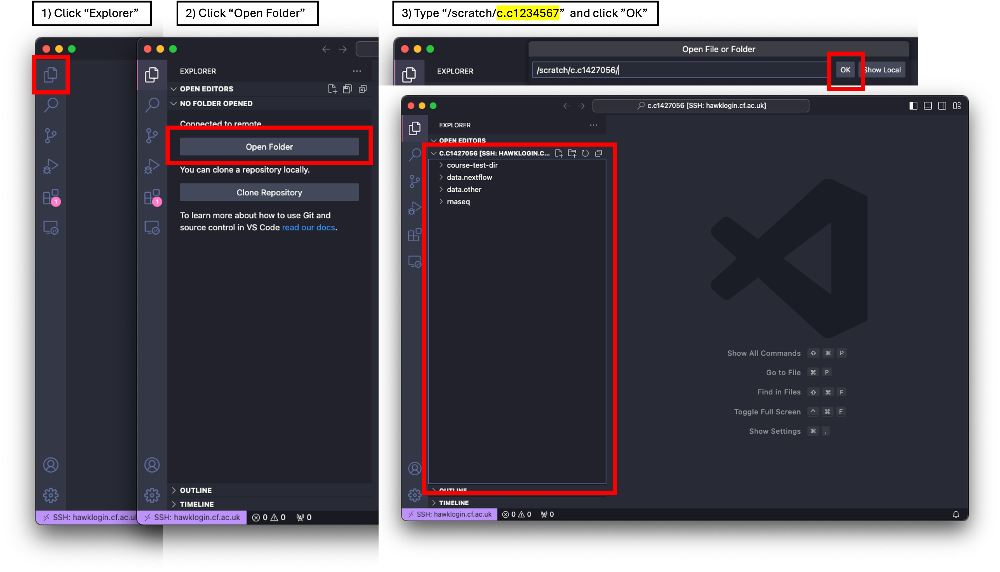

- We next want to fetch the project from GitHub. To do this, we need a terminal window open so we can paste the code into.
- Click on 'Terminal' at the top of your screen and select 'New Terminal'. This will open a terminal window at the bottom of your VSCode window.

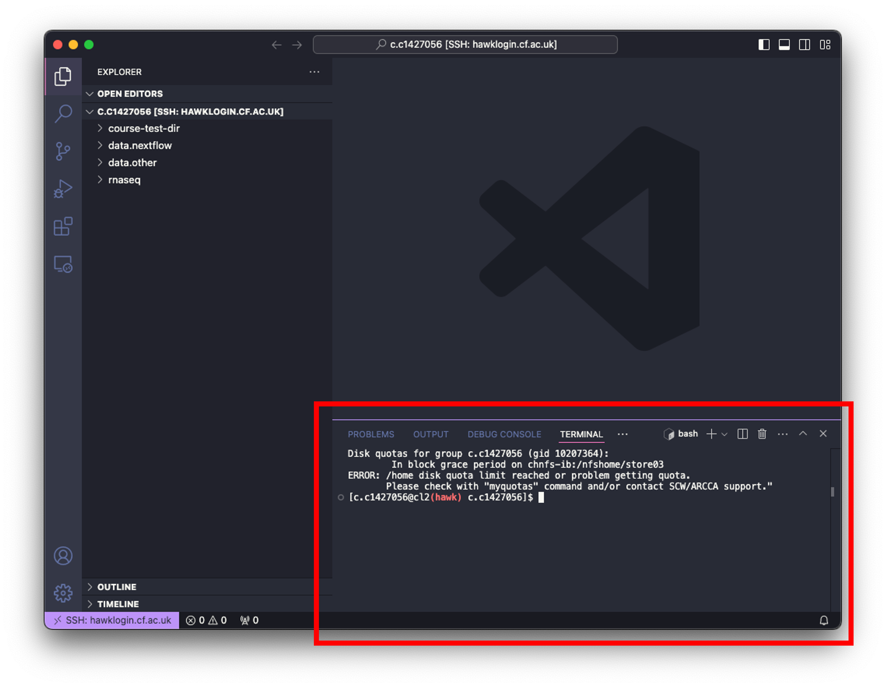

- Now we can simply paste the following code into the terminal and hit enter:

```
git clone https://github.com/Gibbatron/rnaseq-course.git
```
- You will get a notification when things are done.
- To double check if the directory has been downloaded, we can use the `ls` command.
- We should also see that the directory is now in the 'Explorer' window on the left. This may not be the case. To update the window, we can simply click the 'Refresh Explorer' button.

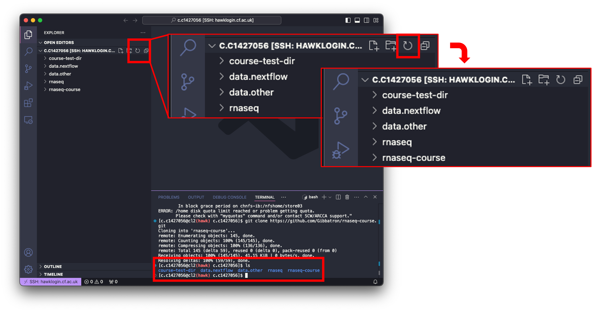

- To see the contents of the downloaded directory, you can click on it to expand, or use the drop-down arrow next to it.

***Linux Users***
- use `cd` command to move to your scratch directory and then input the following command:

```
cd /scratch/c.c1234567
git clone https://github.com/Gibbatron/rnaseq-course.git
```

---
### Set-up
---
---

- We need to change permissions of the rnaseq-course directory so that any daughter files and directories will inherit the same permissions:
- In the terminal window paste the following:

```
chmod -R 777 rnaseq-course #777 gives read, write, and execute permissions for everyone

setfacl -d -m u::rwx,g::rwx,o::rwx rnaseq-course #this code gives same permissions to daughter files and directories that are made.
```

- We also need to change permissions of the scripts in the bin directory:

```
cd rnaseq-course/bin
chmod +x *.sh
```

- Note: When changing directories within the terminal window, **the explorer window does not update as you go**, neither does it update if you click the refresh button.
- Note: You can move in- and out of directories using the explorer window. Right-clicking on the directory and clicking on 'Open in Integrated Terminal' will open the directory in the terminal window. There will be another section added to the terminal window on the right with two options. One named 'bash', the other named 'bash *rnaseq-course*'. The 'bash' option is where you originally were (your scratch directory) and the 'bash *rnaseq-course*' option is in the rnaseq-course directory. Clicking between these moves you to the subsequent directory and you will notice the terminal window changes with this too.

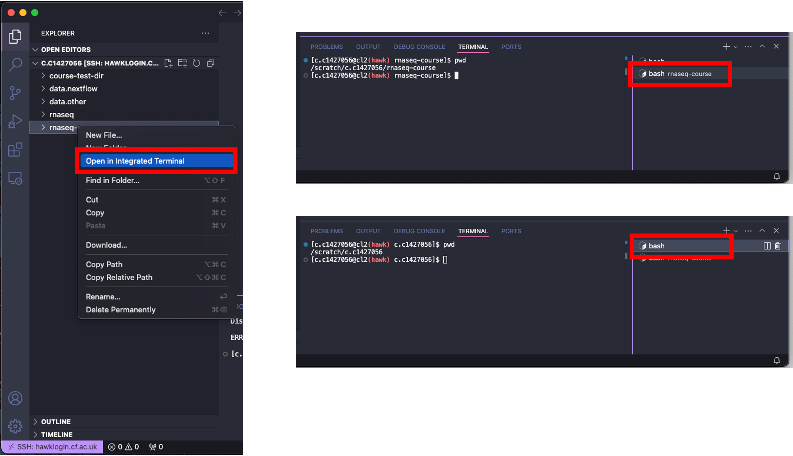

---
#### Required files
---
---

- Now that we have the permissions etc completed, we can now edit the required files needed for the fetchngs pipe.
- You will see, by using the `ls` command, or clicking the drop down options on the directories that we have the following directory structure:

```
.
└── rnaseq-course/
    ├── bin/
    │   ├── differentialabundance.sh
    │   ├── download-ref-genome.sh
    │   ├── fetchngs.sh
    │   ├── generate-samplesheet.sh
    │   ├── make-table-diff-abundance.sh
    │   └── rnaseq.sh
    ├── resources/
    │   ├── conditions.csv
    │   ├── contrasts.csv
    │   ├── diff-abundance-params.yaml
    │   ├── example-conditions.csv
    │   ├── fetchngs-params.yaml
    │   ├── ids.csv
    │   ├── my.config
    │   └── rnaseq-params.yaml
    ├── input/
    │   ├── fastq/
    │   └── example_fastqs/
    └── output/
```

- **Note: We will be executing the pipeline from the parent directory (rnaseq-course)**
- **Note: In addition to above note, all file paths are in relation to the parent directory**

<br>

###### resources/ids.csv

- Now that we have the sample IDs, we can go ahead and add them to the `ids.csv` file.
- This file is a comma-separated value (.csv) file that contains the list of the sample IDs that we just downloaded.

<details>
<summary><b>What is a comma-separated values (.csv) file?</b></summary>

<br>

- A .csv file is simple text file that stores tabular data such as text and numbers in a specific structured format.
- Each line of the file corresponds to one row in the table.
- Within each line, fields(columns) are separated by commas.
- For example, the .csv for the table below looks like:

<br>

 <table>
  <tr>
    <th>Column-1</th>
    <th>Column-2</th>
    <th>Column-3</th>
  </tr>
  <tr>
    <td>input1</td>
    <td>input2</td>
    <td>input3</td>
  </tr>
  <tr>
    <td>input4</td>
    <td>input5</td>
    <td>input6</td>
  </tr>
   <tr>
    <td>input7</td>
    <td>input8</td>
    <td>input9</td>
  </tr>
</table>

<br>

<pre><span style="color:crimson;">
Column-1,Column-2,Column-3
input1,input2,input3
input4,input5,input6
input7,input8,input9
</span></pre>

<br>

</details>

<br>

- To add our IDs to the .csv, we need to open `ids.csv`, delete the text already there, then paste our list straight in.
- To open the file in VSCode, we can click on it which will open the file in the main window, or we can right-click on the file and click 'Open With...'. This will open a drop-down menu at the top of the screen. Select 'CSV Editor'.
- This will load the file into the main window as a table rather than its native format - this will make it easier for you to edit and understand the structure of the file.
- I would reccomend just clicking on it to open though, as the file has only one column.

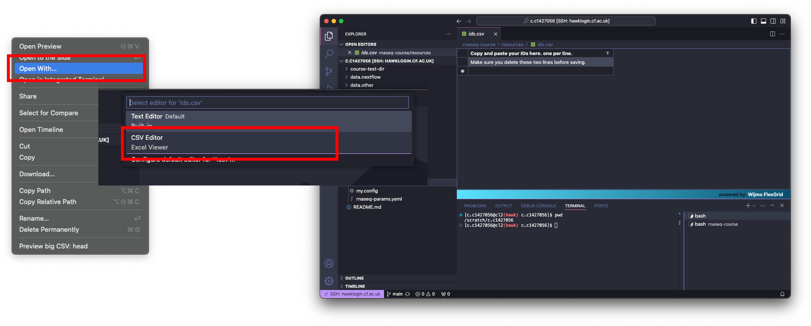

- With the file open, delete the text in both rows and paste your IDs into the table.
- Now save the table with `File > Save`.
- To close the file, click on the 'X' next to the filename along the top of your window.

***Linux Users***
```
nano resources/ids.csv

# delete the text

# paste your list in:
SRR23454118
SRR23454119
SRR23454122
SRR23454124
SRR23454125
SRR23454126

# save the file
ctrl + x
y
enter
```

<br>

###### resources/fetchngs-params.yaml

- This file contains all of the parameters needed for the pipeline to run.
- Instead of adding all of the options into the code when executing the pipeline, we can add them into this file. This keeps things tidier and easier to troubleshoot.

- **We need to change the email address in this file.**

- Open the file in VSCode by simply clicking on it, then change your email address.
- Then save the file by clicking `File > Save`. Close the file by clicking the 'X' next to the filename along the top of your window.

***Linux Users***
```
nano resources/fetchngs-params.yaml

# change your email:
input: resources/ids.csv
outdir: input
nf_core_pipeline: rnaseq
email: <b>your-email@cardiff.ac.uk</b>

# save the file
ctrl + x
y
enter
```

- input: Where the input ids.csv file is located. *Note: This is in relation to the parent directory.*
- outdir: Where to save the outputs to. *Note: This is in relation to the parent directory.*
- nf_core_pipeline: Formats the output data so that it conforms with the required inputs for the rnaseq pipeline that we will be using further down the line.

<br>

###### resources/my.config

- This file contains all of the configuration code required for the pipeline to run correctly on HAWK.

- **We only need to change the email.**

- Open the file in VSCode by simply clicking on it, then change your email address and scw account.
- Then save the file by clicking `File > Save`. Close the file by clicking the 'X' next to the filename along the top of your window.

***Linux Users***
```
nano resources/my.config

# change your email:

params {
  config_profile_description = 'Super Computing Wales'
  config_profile_contact = 'your-email@cardif.ac.uk'
  config_profile_url = 'https://supercomputing.wales/'
  max_memory = 180.GB
  max_cpus = 20
  max_time = 72.h
}

singularity {
  enabled = true
  autoMounts = true
}

process {
  executor = 'slurm'
  queue = 'compute_amd'
}

executor {
  queueSize=10
}

process {
beforeScript = 'module load singularity-ce/3.11.4'
clusterOptions = '--account=scw2345'
}

# save the file
ctrl + x
y
enter
```

---
## Executing the nf-core/prefetch pipeline
---
---

- Now we have everything ready to execute the pipeline.
- To run the pipeline, we need to be in the **parent directory (rnaseq-course)** directory.
- We will be using tmux to execute the pipeline.

<details>
<summary><b>What is tmux?</b></summary>
- Tmux is a tool that we use to run multiple terminal sessions at once.
- We can use tmux to run our pipelines in the background, which leaves us to do other tasks in the meantime, or logout.
- If we were to run the pipeline without tmux, we would have to stay logged into HAWK until the pipeline has finished running.
- This can be problematic because 1) most pipelines can take a VERY long time to run, and 2) connection problems. If you are disconnected for any reason, the pipeline will cancel.
- Using tmux allows us to open a new terminal window, run the pipeline, and close the session so that it runs in the background.
- We can then log out of our HAWK session and log back in once we have been notified of the pipelines completion.

</details>

---
**Change to the cla1 node**

---

- <b>Jan'25 update:</b> we need to change to the amd compute node for the purpose of this course.
- To do this, enter the following in the terminal window:

```
ssh cla1
```

- You will be prompted continue. Type 'yes'.
- There will be text on the screen saying 'One-time SSH cleanup for Hawk gen 2...'.
- Wait for this to complete, you will then see '...done'.

---
**Launch a tmux session**

---

- From the **parent** directory (`rnaseq-course` - you will need to use the cd command to get there), run the following in the terminal window:

```
cd /scratch/c.c1234567/rnaseq-course/
module load tmux
tmux new -s fetchngs
```

- This loads the tmux module in HAWK and opens a new tmux session called fetchngs.

---
**Load Modules**

---

- With the tmux session opened, paste the following:

```
module load nextflow/24.10.4
module load singularity/singularity-ce/3.11.4
```

- This loads the required modules for the pipeline to run.

---
**Execute pipeline**

---

- Now we can go ahead and execute the pipeline.
- Usually, we would run the pipeline by typing out the command followed by the options etc etc.
- To make thinks simpler for everyone, and to avoid typos etc, I have added this command to a script (`bin/fetchngs.sh`).
- To execute the pipeline, all we need to do is run this script:

```
./bin/fetchngs.sh
```

- This will run the pipeline for us. Leave the pipeline run for a few minutes to ensure it is working, then we can close the session by doing the following:

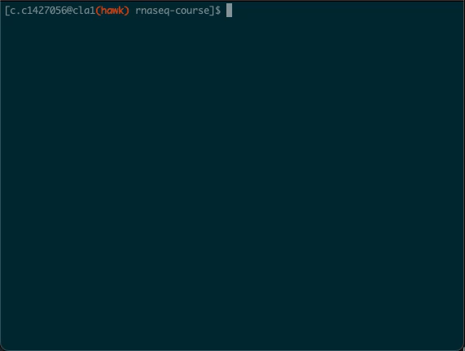

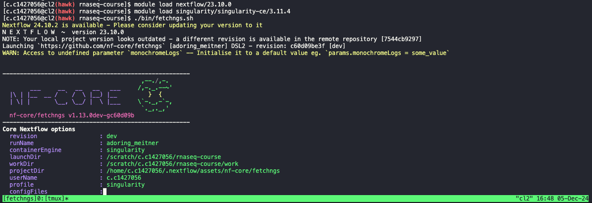


```
Ctrl + b

then press d
```

- We will cover the outputs from this pipeline during the Day 2 session.

---
---
# End of Day 1
---
---
